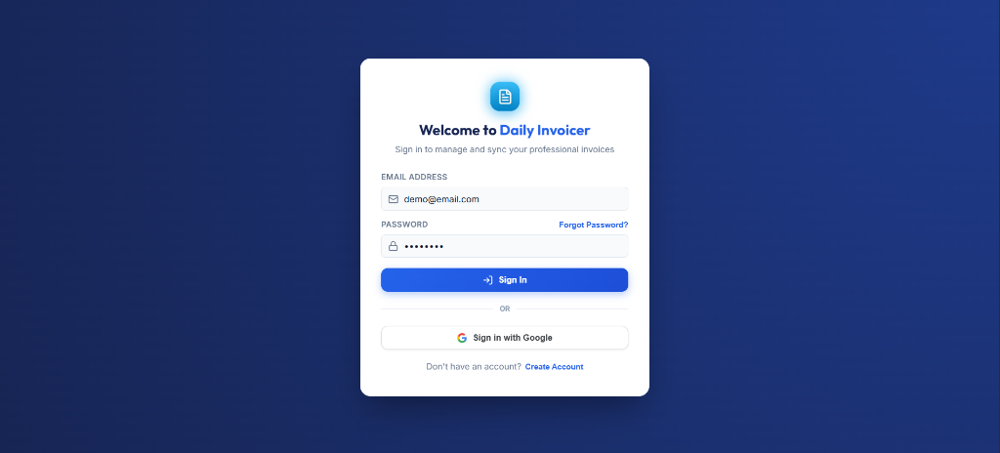
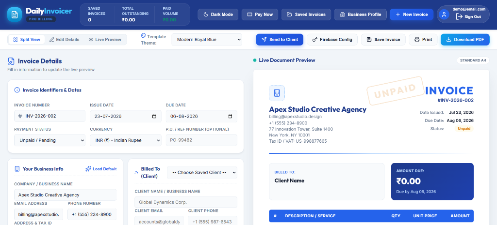
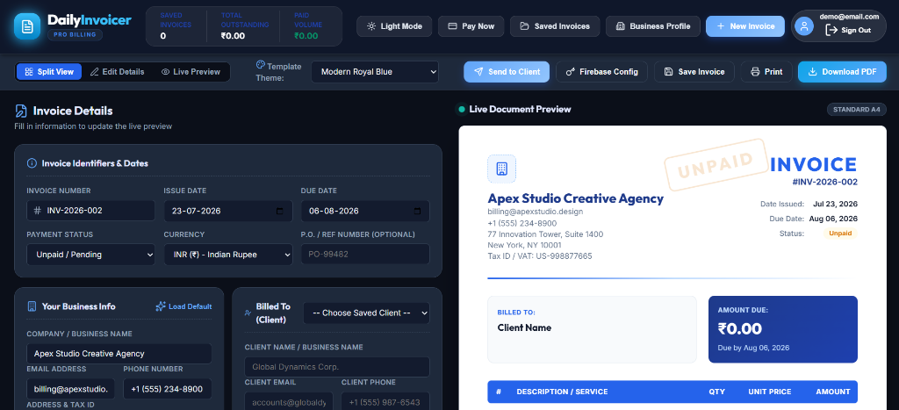
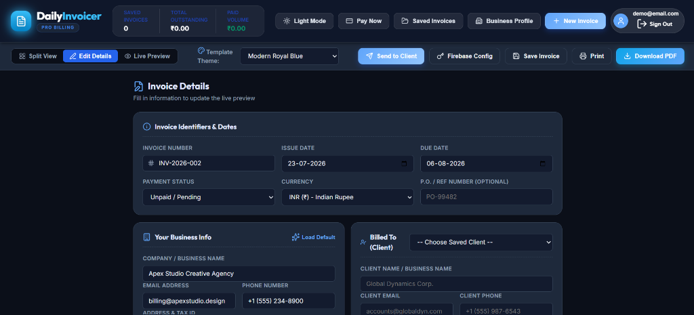
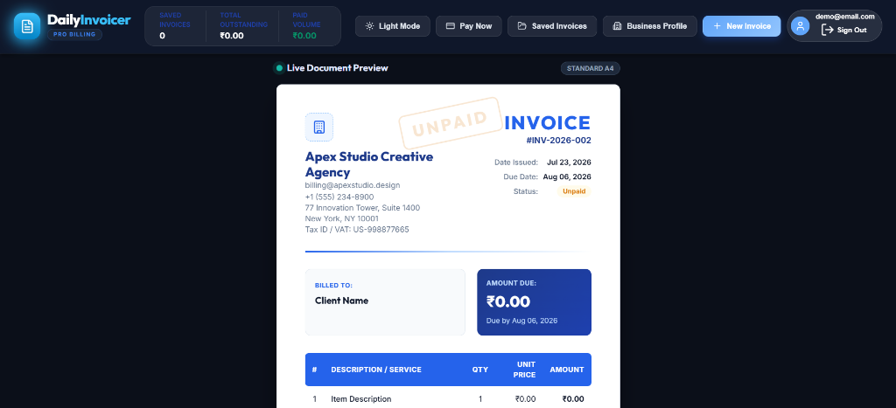

# 📄 Daily Invoicer - Professional Billing & Invoice Solution

[](https://daily-invoicer.web.app/)
[-0078D4?style=for-the-badge&logo=windows&logoColor=white)](https://github.com/devvrushabh/daily-invoicer/releases/download/v1.0.0/Daily_Invoicer_Setup.exe)
[](https://daily-invoicer.web.app/)
[](LICENSE)

**Daily Invoicer** is a modern, high-performance web application designed for freelancers, agencies, and small businesses to create, customize, manage, export, and email professional invoices in seconds. Featuring real-time document rendering, user-scoped Firebase authentication, cloud Firestore synchronization, interactive payment checkout gateways, and client email dispatching.

🌐 **Live Application**: [https://daily-invoicer.web.app/](https://daily-invoicer.web.app/)
📦 **Windows Installer (.exe)**: [Download Release v1.0.0](https://github.com/devvrushabh/daily-invoicer/releases/download/v1.0.0/Daily_Invoicer_Setup.exe)

---

## 🔑 Demo Account Credentials

Experience all cloud features, Firestore invoice saving, and profile synchronization using the pre-configured demo account:

> [!IMPORTANT]
> **Demo Account Login Credentials**  
> 📧 **Email**: `demo@email.com`  
> 🔑 **Password**: `Demo@123`

You can sign in using these credentials directly on the application overlay to access saved invoices across devices.

---

## 📸 Step-by-Step Application Walkthrough & Screenshots

### Step 1: Secure Account Authentication & Sign In
The application features a clean, modal-based authentication overlay. Users can sign in using their account credentials, create a new account, reset forgotten passwords, or use one-click **Google Sign-In**. It also includes a seamless local fallback authentication mode for offline reliability.



---

### Step 2: Main Workspace & Split View Editor (Light Mode)
The default **Split View** workspace combines a comprehensive form editor on the left with a live, real-time document canvas on the right. As you type business details, client info, line items, or tax rates, the invoice document updates instantly.



---

### Step 3: Dark Mode Experience & High-Contrast Theme
Daily Invoicer includes a built-in Dark Mode theme toggle for low-light environments. Powered by HSL CSS design tokens, it offers a smooth 400ms transition while maintaining high readability and visual contrast.



---

### Step 4: Focused Invoice Details & Metadata Editor
Switching to **Edit Details** mode collapses the preview pane, providing a distraction-free environment for entering invoice numbers, issue and due dates, business profiles, client details, payment terms, and multiple line items.



---

### Step 5: Clean Live Document Preview & A4 Printable Sheet
Switching to **Live Preview** mode gives a full-width view of the final printable A4 invoice sheet. Displays status stamps (UNPAID, PAID, OVERDUE), logo branding, dynamic currency symbols, summary calculations, and one-click **Download PDF** or **Print** buttons.



---

## ✨ Key Features

- **⚡ Real-Time Live Preview Canvas**: Instant visual feedback on every line item, calculation, tax rate, and discount change.
- **🔐 Firebase Authentication & Cloud Sync**:
  - Email & Password Sign-In / Sign-Up with automatic fallback.
  - One-click **Google Sign-In** support.
  - User-scoped **Firestore Cloud Database** synchronization.
- **🌙 Dark / Light Theme Engine**: Smooth 400ms CSS variable transitions with system theme auto-detection.
- **💳 Integrated Multi-Gateway Payment Checkout**:
  - Credit / Debit Card payments via **Stripe**.
  - **PayPal** express checkout.
  - **Razorpay** & Dynamic **UPI QR Code Generator** (GPay, PhonePe, Paytm).
  - Direct Bank Transfer / Wire details.
  - **Sandbox Test Mode** toggle for zero-risk testing.
- **✉️ Direct Client Email Delivery**:
  - One-click prefilled **Gmail Web Compose** tab dispatcher.
  - **EmailJS** API & SMTP direct inbox delivery support.
  - Automated payment confirmation receipts.
- **📄 High-Resolution PDF Export**: Single-click client-side A4 PDF download using `html2pdf.js` and browser print formatting.
- **🏢 Business Profile & Asset Management**: Store default company details, custom logos, payment terms, and payee UPI IDs.
- **💾 Offline Backup & Export**: Export complete account data as portable `.json` backup files.

---

## 🛠️ Technology Stack

- **Frontend**: HTML5, Vanilla JavaScript (ES6+ Modules), CSS3 (Modern HSL Design Tokens & Dark Mode System)
- **Icons & Fonts**: Lucide Icons, Google Fonts (Inter & Outfit)
- **Backend & Cloud**: Firebase v10 SDK (Auth & Cloud Firestore), Python HTTP Server (local test server)
- **Export & Tools**: `html2pdf.js`, Vite, GitHub Actions CI/CD Pipeline
- **Deployment**: Firebase Hosting (`daily-invoicer.web.app`)

---

## 🚀 Getting Started Locally

### Prerequisites
- Node.js (v18 or higher)
- npm or yarn

### Installation
1. **Clone the repository**:
   ```bash
   git clone https://github.com/devvrushabh/daily-invoicer.git
   cd daily-invoicer
   ```

2. **Install dependencies**:
   ```bash
   npm install
   ```

3. **Start local development server**:
   ```bash
   npm run dev
   ```
   Open your browser at `http://localhost:5173`.

4. **Build for Production**:
   ```bash
   npm run build
   ```
   The optimized production bundle will be generated in the `dist/` directory.

---

## 🔄 CI/CD & Deployment Pipeline

This repository includes a continuous integration and deployment workflow powered by **GitHub Actions** (`.github/workflows/firebase-hosting-deploy.yml`).

Every `git push` to the `main` branch automatically triggers:
1. Repository checkout (`actions/checkout@v4`)
2. Node.js environment initialization (`actions/setup-node@v4`)
3. Dependency installation (`npm ci`)
4. Production bundle build (`npm run build`)
5. Automatic deployment to **Firebase Hosting** (`FirebaseExtended/action-hosting-deploy@v0`)

---

## 📝 License

Distributed under the MIT License. See `LICENSE` for more details.

---

<p align="center">Made with ❤️ by <a href="https://github.com/devvrushabh">Vrushabh Dhote</a></p>
